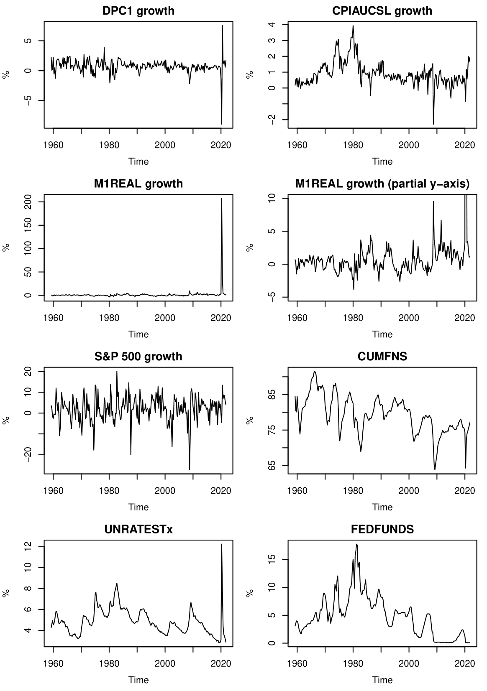

# GDP Growth Forecast - A Vector Autoregression Approach

**Project by Chang-Chia Chen and collaborators: Ana Sofia Salinas Cantu, Semen Kuznetskiy**

This project forecasts the US real GDP growth using autoregression (AR) and vector autoregression (VAR) models based on historical economic data from 1959Q1 to 2021Q4. It analyzes different economic indicators and compares forecasting performances across models.

## Project Overview
- **Objective**: Predict the US GDP growth one-quarter ahead using both AR and VAR models, utilizing historical economic variables such as CPI, Unemployment Rate, S&P 500 index, and others.
- **Tools**: R language for statistical modeling and visualization.

## Data Sources
The data is derived from the [**FRED-QD database**](https://research.stlouisfed.org/econ/mccracken/fred-databases/) from the Federal Reserve Bank of St. Louis. The key variables used include:
- GDPC1 (Real GDP)
- CPIAUCSL (Consumer Price Index)
- M1REAL (Real M1 Money Stock)
- S&P 500 Index
- CUMFNS (Capacity Utilization Rate)
- UNRATESTx (Unemployment Rate less than 27 weeks)
- FEDFUNDS (Federal Funds Rate)

## Key Methods
1. **Autoregressive (AR) Model**: A simple linear model using the past GDP growth values to predict future values.
2. **Vector Autoregressive (VAR) Model**: This uses multiple variables (GDP, CPI, etc.) to predict future GDP growth.
3. **Granger Causality Analysis**: Determines which variables have predictive power over GDP growth.
4. **Akaike Information Criterion (AIC)**: Used to select the best lag-order for the VAR model.

## Results
- The AR(1) model performed well for relatively stable periods, while the VAR models were more effective during economic fluctuations.
- The VAR(1) and VAR(p) models struggled during extreme events like the 2020 COVID-19 pandemic due to exaggerated fluctuations in variables.

## Requirements
- **R**: Version 4.1.2 or higher.
- **R Packages**:
  - `tseries`: For time series analysis.
  - `vars`: For vector autoregression.

## How to Run
1. Download the dataset from the FRED-QD database and prepare it as described in the project report.
2. Run the `main.R` script to generate forecasts, plots, and analysis results.

## Files in the Repository
- **main.R**: The R script for forecasting and analysis.
- **Project_1.pdf**: Detailed project description and results.
- **224733 Chang-Chia Chen.pdf**: Extended project report.

## Conclusion
The project explores different models for GDP forecasting and highlights the strengths of each under various economic conditions. It also suggests future improvements, such as incorporating more real-time variables.

