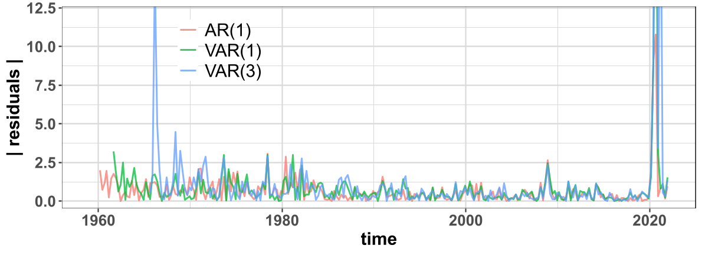
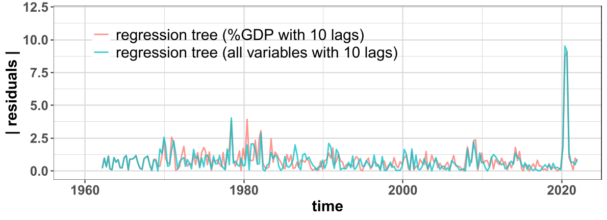
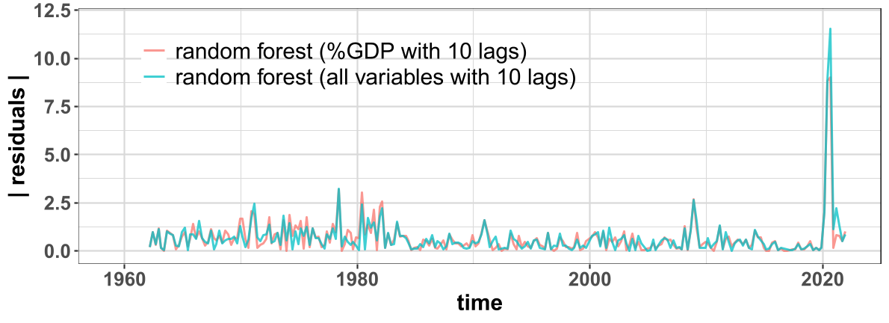
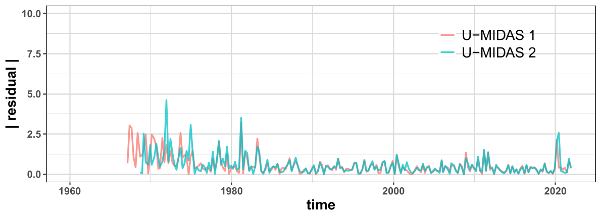
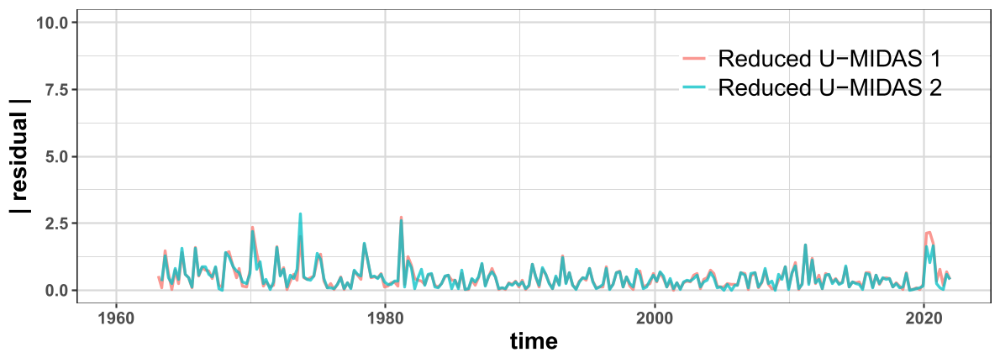
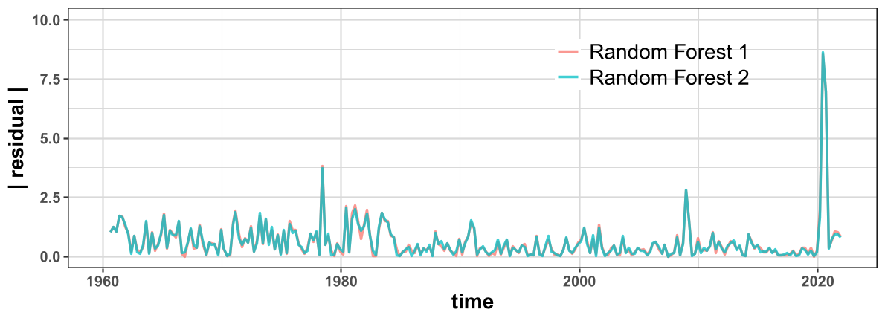
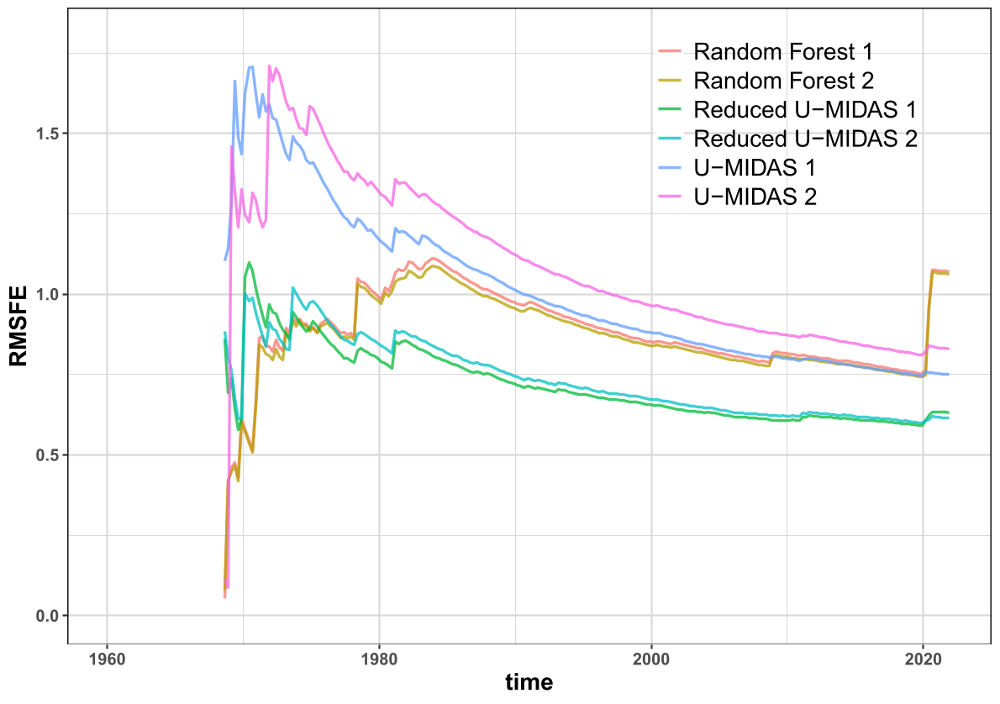

# GDP Growth Forecast - A Multi-Approach Analysis

This repository contains three distinct projects aimed at forecasting US GDP growth. The approaches span from traditional time series models (autoregression and vector autoregression) to machine learning techniques (regression trees and random forests) and advanced mixed-data sampling methods ([MIDAS](https://www.bundesbank.de/resource/blob/703636/67ebc41ad0284bfe43aa7b6cd2c000f6/mL/2011-12-30-dkp-35-data.pdf)). 

## Project Overview
- **Objective**: Predict US GDP growth using multiple models and methods to compare forecast accuracy and robustness.
- **Tools**: R programming language for statistical modeling, machine learning, and data visualization.

## Data Sources
Data is sourced from the **FRED-QD** and **FRED-MD** databases at the [Federal Reserve Bank of St. Louis](https://research.stlouisfed.org/econ/mccracken/fred-databases/). Key variables used across all projects include:
- Real Gross Domestic Product (GDP)
- Consumer Price Index (CPI)
- Unemployment Rate (UnRate)
- S&P 500 Index (SP500)
- Capacity Utilization (CapUti)
- Federal Funds Rate (FedFunds)
- Real M1 and M2 Money Stock

## Project 1: Vector Autoregression (VAR) Approach
1. **Autoregressive (AR) Model**: Predicts future GDP growth using past values.
2. **Vector Autoregressive (VAR) Model**: Incorporates additional economic variables for enhanced predictions.
3. **Granger Causality**: Determines predictive power of variables.
4. **Akaike Information Criterion (AIC)**: Selects the best model lag length.

### Results (Project 1)
- VAR models generally outperformed AR models in periods of economic fluctuation.
- Models struggled during the COVID-19 pandemic due to unexpected shocks.

## Project 2: Machine Learning Approach
1. **Regression Trees**: A tree-based model that uses economic variables to predict GDP growth.
2. **Random Forests**: An ensemble of decision trees for more robust predictions.
3. **Permutation Variable Importance (PVI)**: Assesses the relative importance of input variables.

### Results (Project 2)
- Random forests outperformed regression trees overall but still struggled during economic shocks.
- AR and VAR models provided stronger performance when sufficient training data was available.

## Project 3: Nowcasting with Unrestricted MIDAS (U-MIDAS)
1. **U-MIDAS**: Forecasts GDP growth using monthly economic data while considering lagged effects of both quarterly and monthly variables.
2. **Random Forest (with MIDAS variables)**: Uses monthly frequency data to enhance forecasts.
3. **Bayesian Information Criterion (BIC)**: Determines the lag-order of variables.
4. **Cross-Validation for Time Series**: does not use future information compared to the traditional *k*-fold CV.

### Results (Project 3)
- **U-MIDAS Models**: Performed the best overall, especially during economic crises (2008 and 2020).
- **Random Forest Models**: Showed slight improvements when combined with monthly data but struggled to handle extreme events.
- Including monthly data from the FRED-MD database significantly improved the forecasts compared to the previous projects.

## Conclusion
This collection of projects highlights the evolution of forecasting methods, from traditional time series models to more complex machine learning and mixed-frequency models. While traditional models perform well in stable conditions, machine learning models like random forests show potential when dealing with complex interactions between variables. The introduction of U-MIDAS models significantly improves performance, especially during economic crises.

## Future Work
- Consider the inclusion of additional economic variables such as personal consumption expenditures.
- Explore other variants of MIDAS models, such as ADL-MIDAS.
